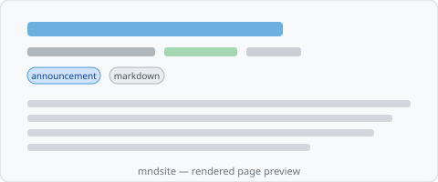

# Introducing mndsite

This site is built with mndsite — a static site renderer for publication-ready markdown and MDX.



Everything you see on this page comes from frontmatter: the date, the "announcement" category chip, and the tags. Reading time appears when supplied in frontmatter (typically filled by mndmap upstream).

## How it works

In the full pipeline, **mndmap** organizes and enriches source content; **mndsite** mirrors that destination and builds the static site:

```text
source → mndmap → destination → mndsite → dist/
```

For standalone use, write markdown with frontmatter, run one build command, and get a fully built static site. The [content pipeline](/features/content-pipeline) handles mirroring, asset copying, navigation generation, and static export.

## Source structure

This post lives at `docs/updates/welcome.md` in the repository.
The pipeline mirrors it to `pages/updates/welcome.mdx`.

The image above (`images/example.svg`) is stored next to this file at
`docs/updates/images/example.svg`. The pipeline copies it to
`public/images/updates/example.svg` and rewrites the reference to an absolute path.

## Next steps

- Read the [Getting Started](/getting-started) guide
- Browse the [Features](/features) section
- Point mndsite at your own mndmap destination or markdown tree
